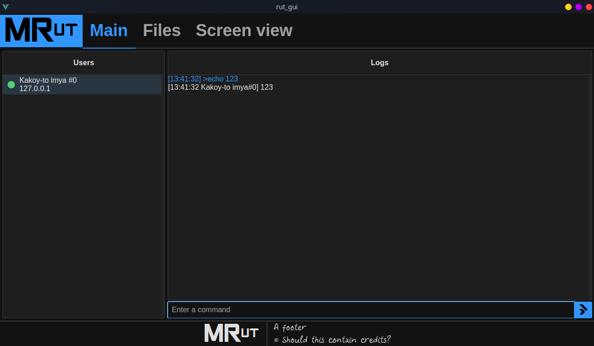
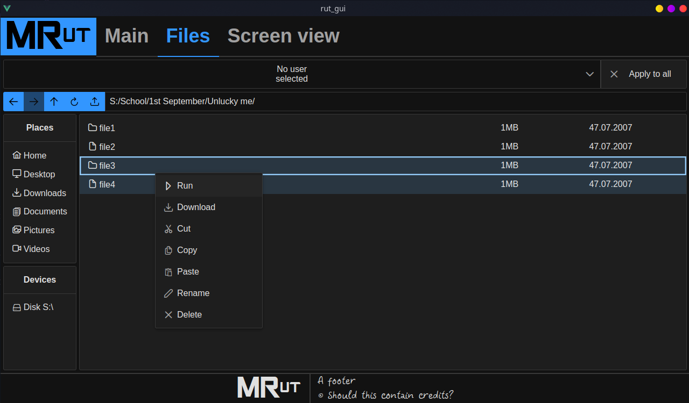
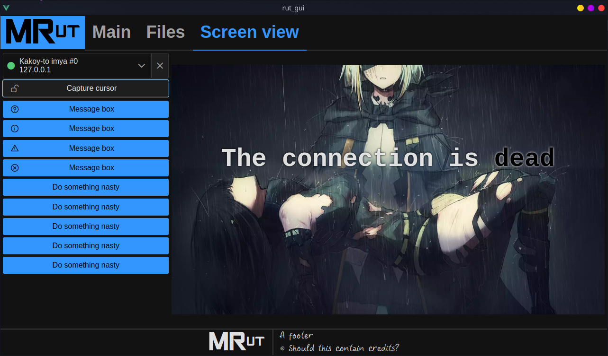

# Multi-target Remote udministration tool, AKA MRut

## TODO
* **FS management**
* ~~**Autostart & install script**~~
  * Install system-wide (all users)
  * Updating
* **Language**:
  * ~~Basics~~
  * Translate everything
* ~~User renaming~~
* ~~Store users (persistent)~~
* **Take over controls:**
  * ~~**Mouse**~~
  * ~~**Keyboard**~~
* Build in demo mode:
  * ~~Client~~
  * RSA demo key
* Chat (complex af)
* Bulk screencast (switch single/many in tab)
* *Encryption*. Можно использовать такое. Будет в action handshake. Но нужно будет генерить клиентов и серверную часть через скрипт ы. https://chat.deepseek.com/a/chat/s/dd12b2d8-8138-413a-a408-4c00abf8a4ee Ышо: https://chat.deepseek.com/a/chat/s/139ca133-320c-4ecd-a5bc-10cc64a85d1a
Прешарить ничего не будем. По умолчанию, клиент доверяет любому сертификату первому. Далее - нужно добавлять сертификаты через сервер доверенный. А на сервере вылезает вопрос, стоит ли доверять, если сертификат ранее не фигурировал или поменялся вдруг. Но это теория. А по факту надо сделать моки, и с ним пока что

## How to run
Install **Node.js 16**, **yarn**, MSVC (Visual Studio 2022), cmake...
```sh
git clone --recursive https://github.com/Foresteam/rut-2.git
cd rut-2
```

Server (./nsv)
```sh
yarn
yarn watch
```

Client (./cl): ` (cd src/lua; yarn) `

To run debug:
```sh
just use vscode...
```

Release: i beleive it's done this way
## Build (Linux)
```bash
cmake .. -DCMAKE_BUILD_TYPE=Release
cmake --build . --config Release -j{NUMBER_OF_THREADS}
```
## Build DEMO (Windows)
Упрощенная сборка без шифрования, и с возможностью замены ключей без пересборки
```bash
cmake .. -G "Visual Studio 17 2022" -DCMAKE_BUILD_TYPE=Release -DDEMO_MODE=true
cmake --build . --target ALL_BUILD --config Release
```
## Build (Windows)
```bash
cmake .. -G "Visual Studio 17 2022" -DCMAKE_BUILD_TYPE=Release
cmake --build . --target ALL_BUILD --config Release
```

## The UI


